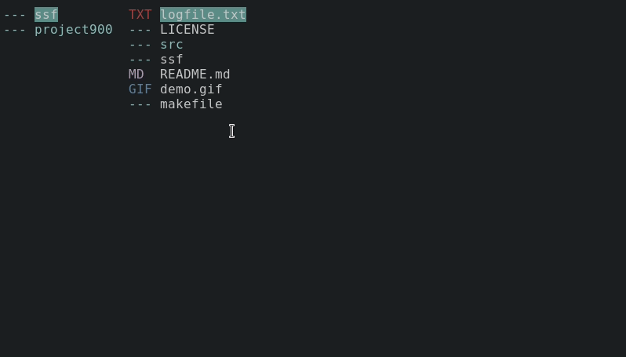

# ssf ( S U P E R     S I M P L E     F I L E explorer xD)

## Features  
* complex icon engine 
* vim-keybindings
* vim integration

## Usage   
| Shortcut      | Description	|
| ------------- |:-------------:|
| h,j,k,l	| move		|
| d		| dotfiles	|
| e		| edit in vim	|
| o		| xdg-open	|
| s		| spawn terminal|

## Build Requirements   
* g++ version 9+

## Dependencies   
* gnome-terminal
* xdg-open
* vim

## Installation   

1) `git clone https://github.com/juli9797/ssf`
2) `make install`

